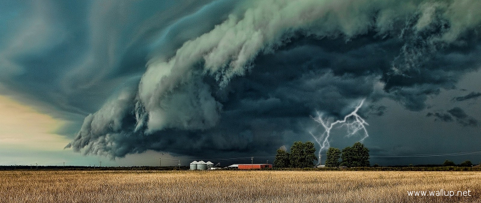

# Nowcasting
Lightning flash-cell identification and nowcasting using machine learning algorithms in Python

### Flash-cell identification
Identification of lightning flash-cells, from the data generated by the lightning detection networks, involves using clustering analysis, which is a form of the unsupervised machine learning. Lightning detection network data has following main attributes: longitude and latitude of lightning strike, time (down to the microsecond) of the lightning strike, amplitude of the lightning current, polarity and type of the strike (cloud-to-ground or intra-cloud). Scikit-learn library is used to perform clustering analysis. Once the cluster(s) is(are) identified, convex hull is used to create a poligon which geometrically identifies each of the lightning flash-cells.

### Flash-cell tracking and nowcasting
Nowcasting stands for the short-term prediction of lightning flash-cell future positions, using movement tracking of the past flash-cell positions. Movement tracking and nowcasting is carried out using weighted least squares analysis and/or VAR analyis from the statsmodels library. Lightning flash-cell are visually represented using the folium maps.

### Lightning density maps
Lightning data is also used to create geographical lightning density maps (e.g. keraunic maps), which have been graphically displayed using the Basemap library (from the matplotlib) and folium maps. Lightning densities are computed by means of the (bivariate) kernel density estimation, using the sckit-learn library.

The Jupyter Notebook can be seen rendered on nbviewer [here](https://nbviewer.jupyter.org/github/sarajcev/nowcasting/blob/master/nowcasting.ipynb)
